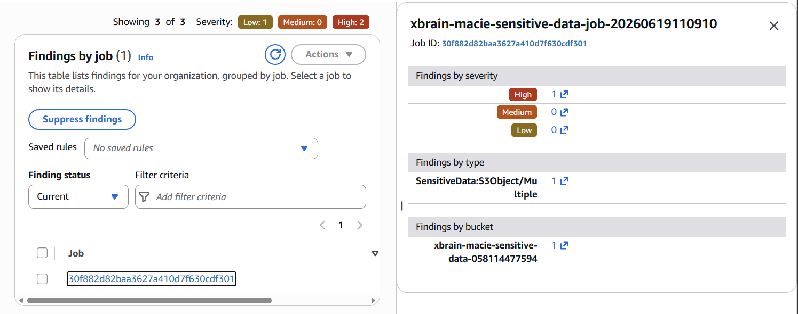
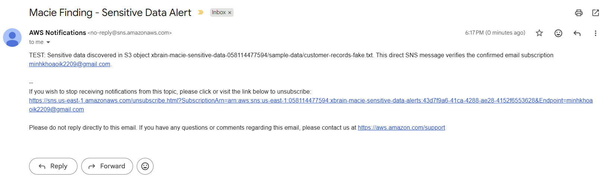

# W10 - Amazon Macie Sensitive Data Lab

Lab phát hiện sensitive data trong S3 và gửi cảnh báo qua email.

## Kiến trúc

```text
Sample files -> S3 bucket -> Macie Job -> Findings -> EventBridge -> SNS -> Email
```

## Mô tả ảnh

### 1. Macie Findings



Ảnh này thể hiện Macie job đã phát hiện finding loại `SensitiveData:S3Object/Multiple` trong bucket `xbrain-macie-sensitive-data-058114477594`. Finding có mức độ `High` và thuộc job `xbrain-macie-sensitive-data-job-20260619110910`.

### 2. Email Alert



Ảnh này thể hiện email cảnh báo từ AWS Notifications qua SNS với subject `Macie Finding - Sensitive Data Alert`, gửi tới `minhkhoaoik2209@gmail.com` và tham chiếu object `sample-data/customer-records-fake.txt` trong S3.
